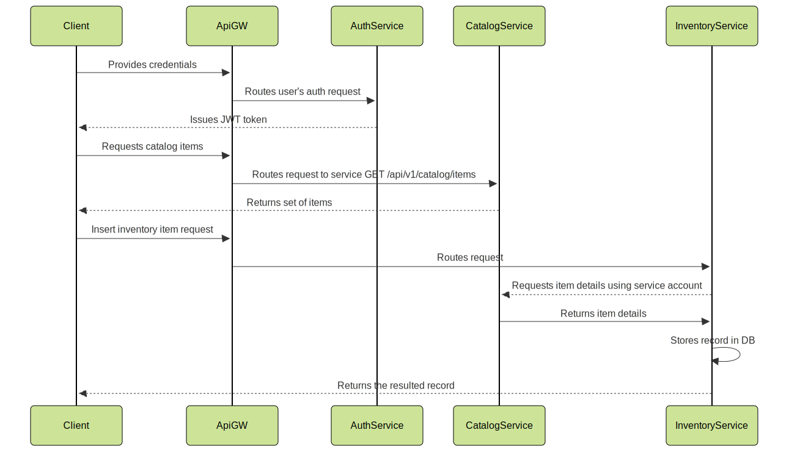

## FoodFlow

FoodFlow is a food inventory management system built on a microservice architecture. The application is designed for tracking, analysing, and controlling food products in warehouses, institutions, and organizations.

## Key features:
 - Tracking product stock by categories, units of measurement, and expiration dates
 - Managing a product catalog
 - Centralized user authentication
 - Single entry point via API Gateway
 - Web interface for employees and administrators

## Technology stack:
 - NestJS + TypeScript (backend)
 - MongoDB (database)
 - Swagger (API documentation)
 - Docker / Docker Compose (deployment)
 - Microservice architecture: domain-based separation (authentication, inventory, catalog, etc.)

## High-level architecture


## Example of inventory and catalog interactions



## Authentication and authorisation
The current implementation uses JWT token-based authorization for users, as well as for microservices as part of the Passport Strategy.
User accounts are created in the Users table, while service accounts for microservices are stored in the Clients table.
Token lifetimes in the current implementation are fixed as follows:
 - User AccessToken: 15 minutes
 - Service token: 30 minutes
 - Refresh token: 7 days

## Env variables example to spin up with docker compose

```dotenv
INVENTORY_SERVICE_URL="http://inventory-service:3011/api/v1"
CATALOG_SERVICE_URL="http://product-catalog-service:3012/api/v1"
AUTH_SERVICE_URL="http://auth-service:3013/api/v1"
JWT_SECRET=my_super_secret
AUTH_DB_URI=mongodb://mongo-service:27017/auth_service
INV_DB_URI=mongodb://mongo-service:27017/inventory_service
CAT_DB_URI=mongodb://mongo-service:27017/product_catalog_service
INV_M2M_ID=inventory_service
INV_M2M_SECRET=password!1
CAT_M2M_ID=product_catalog_service
CAT_M2M_SECRET=password!1
BACKEND_URL=http://caddy
```
## Run with docker compose
```console
docker compose -f docker-compose.dev.yml up 
```

## Creating an admin account
```console
cd seed
pip install -r requirements.txt
python seed_users.py
```
## Creating service accounts
```console
cd seed
pip install -r requirements.txt
python seed_service_accounts.py
```
## Seed catalog with test data 
```console
cd seed
pip install -r requirements.txt
python seed_catalog.py
```
## SwaggerUI

 - http://localhost/auth/api/v1/docs - Auth Service SwaggerUI
 - http://lolalhost/inventory/api/v1/docs - Inventory Service SwaggerUI
 - http://localhost/catalog/api/v1/docs - Catalog Service SwaggerUI
