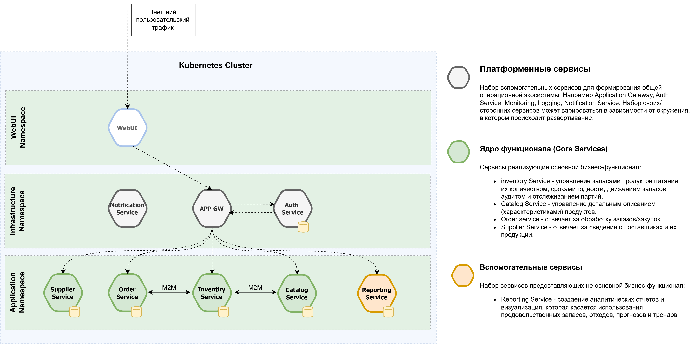
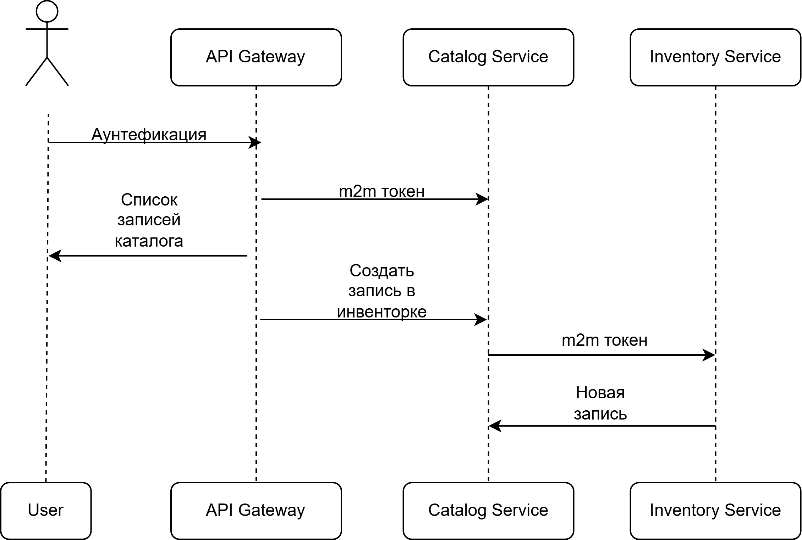

## FoodFlow

FoodFlow — система управления продовольственными запасами, построенная на микросервисной архитектуре. Приложение предназначено для отслеживания, анализа и контроля пищевых продуктов на складах, в учреждениях и организациях.

## Основные возможности:
 - Учёт остатков продуктов по категориям, единицам измерения и срокам годности
 - Управление каталогом продуктов
 - Централизованная аутентификация пользователей
 - Единая точка входа через API Gateway
 - Веб-интерфейс для сотрудников и администраторов

## Технологии:
 - NestJS + TypeScript (бэкенд)
 - MongoDB (база данных)
 - Swagger (документация API)
 - Docker / Docker Compose (развёртывание)
 - Микросервисная архитектура: разделение по доменам (аутентификация, инвентаризация, каталог и др.)

## Выскооуровневоя архитектура

## Пример взаимодействия каталога и инветорки

